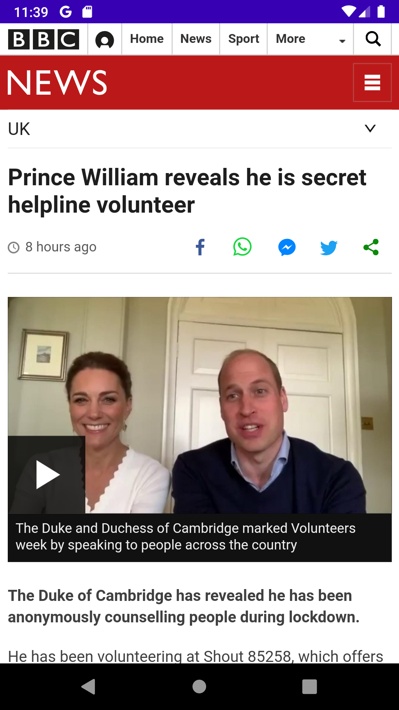

# NewsWRLD
News App(Using Kotlin)

This is my first android app I have built using kotlin. 
This is the basic News App which fetch data from the NewsAPI and show it.   
<b><h2>Here are some ScreenShots:</h2></b>
<table>
  <tr>
    <td>&nbsp&nbsp&nbsp&nbsp&nbsp&nbsp</td>
  </tr>
  <tr>
    <td>&nbsp&nbsp&nbsp&nbsp&nbsp&nbsp</td>
  </tr>
</table>
